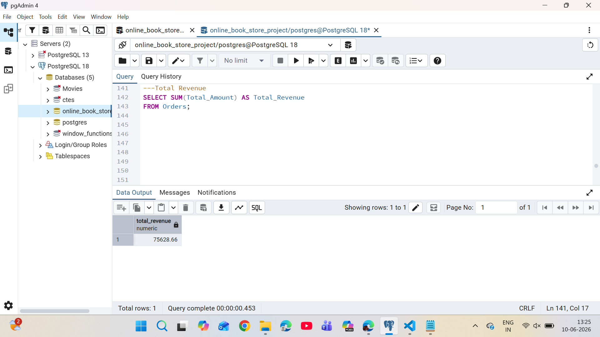
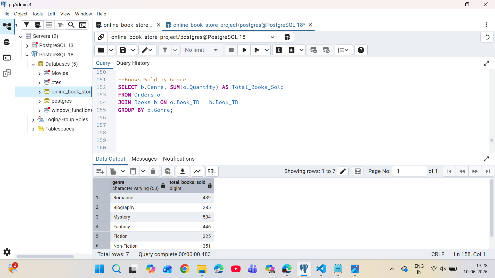
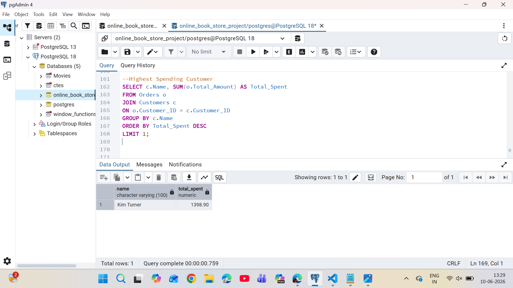

# 📚 Online Bookstore SQL Project

## Project Overview

This project demonstrates SQL database design and data analysis using an Online Bookstore database. The database stores information about books, customers, and orders, enabling analysis of sales performance, customer purchasing behavior, inventory management, and revenue generation.

## Database Schema

### Books

* Book_ID (Primary Key)
* Title
* Author
* Genre
* Published_Year
* Price
* Stock

### Customers

* Customer_ID (Primary Key)
* Name
* Email
* Phone
* City
* Country

### Orders

* Order_ID (Primary Key)
* Customer_ID (Foreign Key)
* Book_ID (Foreign Key)
* Order_Date
* Quantity
* Total_Amount

## SQL Concepts Used

* SELECT
* WHERE
* ORDER BY
* GROUP BY
* HAVING
* Aggregate Functions
* DISTINCT
* INNER JOIN
* LEFT JOIN
* Foreign Keys

## Business Questions Solved

1. Retrieve all books in the Fiction genre.
2. Find books published after 1950.
3. List customers from Canada.
4. Show orders placed in November 2023.
5. Calculate total stock available.
6. Find the most expensive book.
7. Identify orders with quantity greater than one.
8. Find orders with total amount greater than $20.
9. List all available genres.
10. Find the book with the lowest stock.
11. Calculate total revenue.
12. Analyze total books sold by genre.
13. Calculate average Fantasy book price.
14. Identify customers with multiple orders.
15. Find the most frequently ordered book.
16. Show top 3 most expensive Fantasy books.
17. Calculate books sold by author.
18. Find cities with high-spending customers.
19. Identify the highest-spending customer.
20. Calculate remaining stock after fulfilling orders.

## Key Insights

* Total Revenue Generated: **75,628.66**
* Mystery genre recorded the highest sales volume.
* Identified the highest-spending customer using SQL aggregation and sorting techniques.
* Performed sales, customer, and inventory analysis using SQL queries.

## Query Results

### Total Revenue Analysis

### Books Sold by Genre

### Highest Spending Customer

## Dataset

The dataset was imported into PostgreSQL using the pgAdmin Import/Export feature.

## Project Files

* database_schema.sql
* sample_data.sql
* sql_queries.sql

## Tools Used

* PostgreSQL
* pgAdmin
* Visual Studio Code
* GitHub

## Author

**Shafiya**

Aspiring Data Analyst | SQL | Python | Power BI
